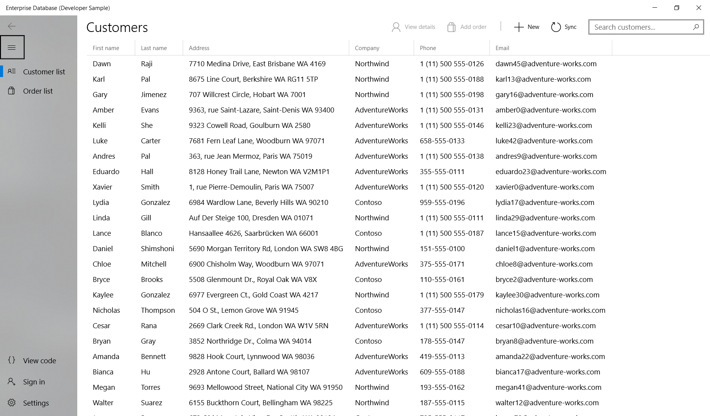

<!---
  category: ControlsLayoutAndText Data IdentitySecurityAndEncryption Navigation NetworkingAndWebServices
-->

# Customers Orders Database sample 

A UWP (Universal Windows Platform) sample app showcasing features useful to enterprise developers, like 
Azure Active Directory (AAD) authentication, UI controls (including a data grid), Sqlite and SQL Azure database integration, 
Entity Framework, and cloud API services. The sample is based around creating and managing customer accounts, orders, 
and products for the fictitious company Contoso. 

[Download and try it now from the Microsoft Store](https://www.microsoft.com/store/apps/9PF1WCV13501). Visual Studio not required. 

## What's new

- Use of new controls like [DataGrid](https://docs.microsoft.com/windows/communitytoolkit/controls/datagrid), 
[NavigationView](https://docs.microsoft.com/uwp/api/windows.ui.xaml.controls.navigationview), and 
[Expander](https://docs.microsoft.com/windows/communitytoolkit/controls/expander).
- Code quality improvements. 

## Features

This sample highlights: 

- The master/details UI pattern
- An editable DataGrid control
- Form layouts
- Authenticating and obtaining user info using Azure Active Directory (AAD)
- Using the repository pattern to connect to Sqlite or SQL Azure databases
- Connecting to an external web API built with ASP.NET Core 2.0

## Run the sample

This sample is designed to connect to an instance of Azure Active Directory for authentication and an external service for data. 
To get you started right away, we've provided some demo data and a test service you can connect to. 
However, in order to debug and explore the full functionality of the app, you'll need to deploy your own instance to Azure.

### Quick start 

### Prepare your environment

This sample requires Visual Studio 2017, the Windows 10 Software Development Kit (SDK) (version 16299 or higher), and the .NET Core 2.0 SDK.

* [Get a free copy of Visual Studio 2017 with support for building Universal Windows apps](http://go.microsoft.com/fwlink/?LinkID=280676)
* [Get the .NET Core 2.0 SDK](https://www.microsoft.com/net/core)

Additionally, to receive the latest updates to Windows and the development tools, and to help shape their development, join 
the [Windows Insider Program](https://insider.windows.com/ "Become a Windows Insider").

> *Note* If you are using Visual Studio 2015, a previous version of this sample which doesn't require Visual Studio 2017 is 
available in the git commit history for this repo.

### Run

Set your startup project as **Contoso.App**, the architecture to x86 or x64, and press F5 to run.

### Complete setup

To fully explore the sample, you'll need to connect to your own Azure Active Directory and data source. Values you need to fill 
are in [Constants.cs](ContosoRepository/Constants.cs). 

- **Client Id**: Set the *AccountClientId* field to your Azure account client Id.
- **API endpoint**: Set the value of the *BaseUrl* constant to match the url the backing service is running on.
- **Set a database connection string**: Set the connection string to one of your own local or remote databases.
- **Associate this sample with the Store**: Authentication requires store association. To associate the app with the Store, 
right click the project in Visual Studio and select **Store** -> *Associate App with the Store*. Then follow the instructions in the wizard.

You can then either start the service running locally, or deploy it to Azure. 

- To run locally, right-click the solution, choose *Properties*, and choose to start both **Contoso.App** and **Contoso.Service** at the same time. 
- To deploy to Azure, right-click Contoso.Service, choose *Publish*, and then follow the steps in the wizard.

## Code at a glance

If you're only interested in specific tasks and don't want to browse or run the entire sample, check out some of these files: 

- Authentication, user info, and Microsoft Graph: [AuthenticationControl.xaml](ContosoApp/UserControls/AuthenticationControl.xaml) 
and [AuthenticationViewModel.cs](ContosoApp/ViewModels/AuthenticationViewModel.cs)
- Master/details and form layouts UI: [CustomerListPage.xaml](ContosoApp/Views/CustomerListPage.xaml), 
[CustomerListPageViewModel.cs](ContosoApp/ViewModels/CustomerListPageViewModel.cs), [CustomerDetailPage.xaml](ContosoApp/Views/CustomerDetailPage.xaml), 
[CustomerDetailPageViewModel.cs](ContosoApp/ViewModels/CustomerDetailsPageViewModel.cs), [OrderListPage.xaml](ContosoApp/Views/OrderListPage.xaml), 
[OrderListPageViewModel.cs](ContosoApp/ViewModels/OrderListPageViewModel.cs), [OrderDetailPage.xaml](ContosoApp/Views/OrderDetailPage.xaml), 
[OrderDetailPageViewModel.cs](ContosoApp/ViewModels/OrderDetailPageViewModel.cs)
- Database and REST connections: The [Contoso.Repository](ContosoRepository/) project.

## Design patterns

### Master/details

This sample demonstrates several flavors of the master/details pattern (side-by-side and stacked). 
The Customers list screen displays a customer list and a details overlay that lets the user view and edit a subset of customer data. 
The user can click the "View details" button to go to the full customer details screen, which shows additional data (such as the list of invoices 
associated with selected customer). 

The Orders list screen displays a list of orders. It uses visual state triggers to selectively display an additional details 
panel when the screen is large enough. To see the full details of an order or to edit it, the user selects "Edit" 
to go to the Order details screen. The Order details screen shows all the info for the order and enables editing. 
The user can search for additional products to add to the invoice.

### Form layouts

The two details screens show how to use headings, labels, and whitespace to organize controls into a form layout. Some controls used include:

- Layout controls: [NavigationView](https://docs.microsoft.com/uwp/api/windows.ui.xaml.controls.navigationview), 
[Grid](https://msdn.microsoft.com/library/windows/apps/Windows.UI.Xaml.Controls.Grid), 
[RelativePanel](https://msdn.microsoft.com/library/windows/apps/Windows.UI.Xaml.Controls.RelativePanel), 
[StackPanel](https://msdn.microsoft.com/library/windows/apps/Windows.UI.Xaml.Controls.StackPanel), 
[Expander](https://docs.microsoft.com/windows/communitytoolkit/controls/expander)
- Data controls: [DataGrid](https://docs.microsoft.com/windows/communitytoolkit/controls/datagrid), 
[ListView](https://msdn.microsoft.com/library/windows/apps/Windows.UI.Xaml.Controls.ListView), 
[AutoSuggestBox](https://msdn.microsoft.com/library/windows/apps/Windows.UI.Xaml.Controls.AutoSuggestBox)
- Other controls: [Button](https://msdn.microsoft.com/library/windows/apps/Windows.UI.Xaml.Controls.Button), 
[HyperlinkButton](https://msdn.microsoft.com/library/windows/apps/Windows.UI.Xaml.Controls.HyperlinkButton), 
[context menu](https://msdn.microsoft.com/windows/uwp/controls-and-patterns/menus)

## See also

- [Web account manager](https://msdn.microsoft.com/windows/uwp/security/web-account-manager)
- [Microsoft Graph](https://graph.microsoft.io/)
- [Http client](https://msdn.microsoft.com/windows/uwp/networking/httpclient)
- [Screen sizes and breakpoints](https://msdn.microsoft.com/windows/uwp/layout/screen-sizes-and-breakpoints-for-responsive-design)
- [Define layouts with XAML](https://msdn.microsoft.com/windows/uwp/layout/layouts-with-xaml)
- [Master/details pattern](https://msdn.microsoft.com/en-us/windows/uwp/controls-and-patterns/master-details)
